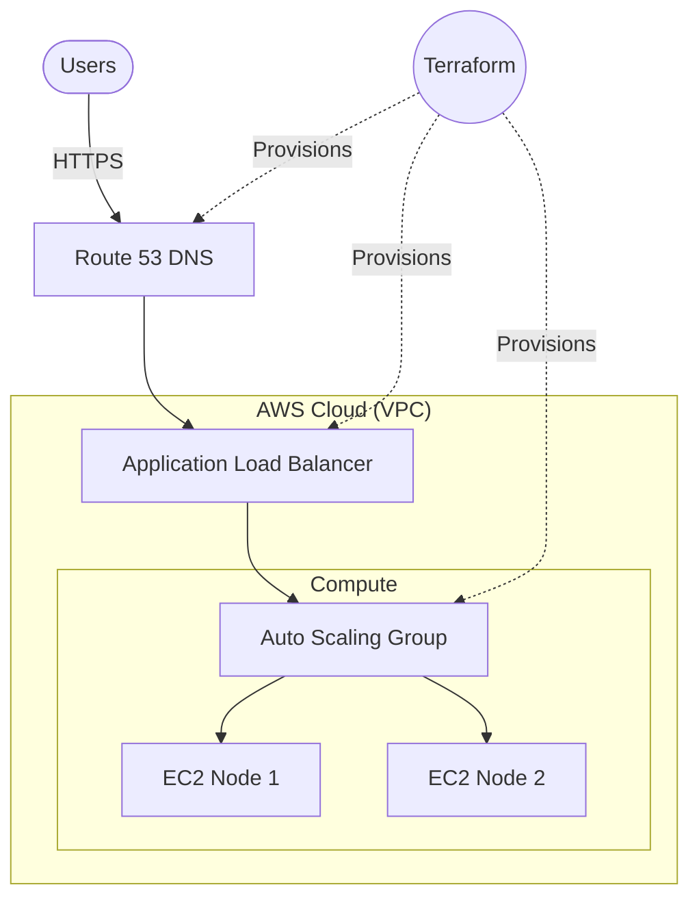

# Infrastructure-as-Code ChatApp Deployment

Terraform setup for deploying a real-time chat app on AWS. Handles networking, compute, DNS, and monitoring.

## Project Overview

Everything needed to spin up the chat app on AWS is defined in Terraform. Network, compute, security groups, and DNS are all version-controlled and repeatable.

## Key Features

- **Automated Infrastructure Provisioning**: Complete AWS infrastructure setup with Terraform
- **Scalable Architecture**: EC2 instances with auto-scaling capabilities
- **DNS Management**: Custom domain routing and SSL certificate management
- **Security Best Practices**: VPC setup, security groups, and IAM role configuration
- **Environment Management**: Separate configurations for development, staging, and production
- **Monitoring Setup**: CloudWatch integration for application and infrastructure monitoring

## Infrastructure Components

### Network Layer

- **VPC Configuration**: Custom Virtual Private Cloud with public and private subnets
- **Security Groups**: Firewall rules for web traffic and SSH access
- **Internet Gateway**: Public internet access configuration
- **Route Tables**: Network routing for optimal traffic flow

### Compute Layer

- **EC2 Instances**: Optimized instance types for chat application workload
- **Auto Scaling Groups**: Automatic scaling based on traffic demand
- **Load Balancer**: Application Load Balancer for high availability
- **Key Pair Management**: SSH key management for secure access

### DNS and SSL

- **Route 53**: DNS management and domain routing
- **Certificate Manager**: SSL/TLS certificate provisioning
- **CloudFront**: CDN setup for improved performance

## Technology Stack

- **Infrastructure as Code**: Terraform with HCL syntax
- **Cloud Provider**: AWS (EC2, VPC, Route 53, CloudWatch)
- **Configuration Management**: Terraform modules and variables
- **Version Control**: Git-based infrastructure versioning
- **CI/CD Integration**: GitHub Actions for automated deployments

## DevOps Practices

- **Infrastructure Versioning**: Git-based infrastructure change tracking
- **Environment Parity**: Consistent infrastructure across all environments
- **Automated Deployments**: One-click infrastructure provisioning
- **Resource Tagging**: Organization and cost tracking for all resources
- **State Management**: Remote state storage with locking mechanism

