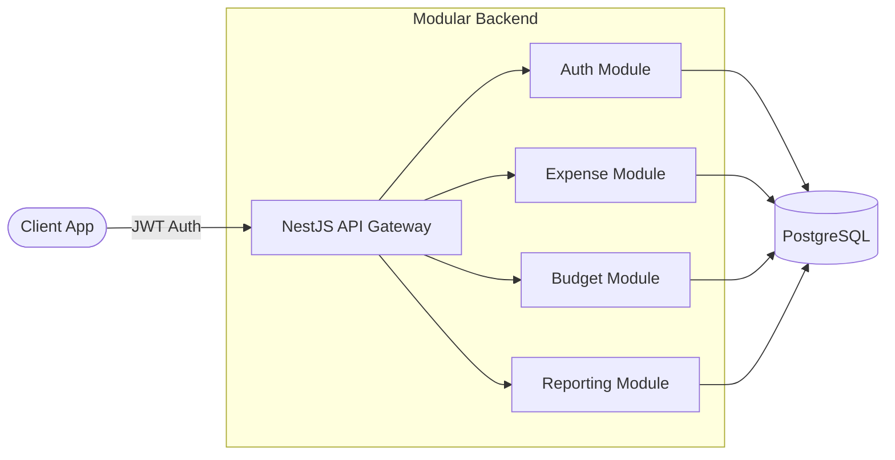

# Expense Tracking and Budgeting API

Expense management API built with NestJS and TypeORM. Handles authentication, role-based access, and spending aggregation.

## Key Features

- **JWT-based Authentication**: Secure user authentication and authorization system
- **Role-based Access Control**: Different permission levels for users and administrators
- **Data Aggregation**: Intelligent expense categorization and spending analysis
- **Scheduled Summaries**: Automated expense reports and budget notifications
- **RESTful API Design**: Clean, well-documented API endpoints
- **Swagger Documentation**: Interactive API documentation for easy integration

## Technical Implementation

The application follows a modular architecture with clean separation of concerns:

- **Authentication Module**: JWT token management and user session handling
- **Expense Module**: CRUD operations for expense management
- **Budget Module**: Budget creation, tracking, and alerts
- **Reporting Module**: Data aggregation and summary generation
- **User Management**: Role-based user administration

## Technology Stack

- **Backend Framework**: NestJS with TypeScript
- **Database**: PostgreSQL with TypeORM
- **Authentication**: JWT tokens with role-based access
- **Documentation**: Swagger/OpenAPI specification
- **Validation**: Class-validator for input validation
- **Testing**: Jest for unit and integration tests

## Architecture Decisions

- **Why NestJS over Express**: Module boundaries are enforced at the framework level, so the auth, expense, budget, and reporting domains stay isolated instead of bleeding into a single router file. Dependency injection also keeps test setup small — providers swap in cleanly.
- **Why TypeORM**: Entity-first modelling lined up with the domain (User, Expense, Budget, Category) and made schema changes traceable via migrations rather than hand-rolled SQL diffs.
- **JWT over session cookies**: API is consumed by multiple clients (mobile, web); stateless tokens removed the need for shared session storage and kept horizontal scaling cheap.
- **Role-based access**: Encoded as claims in the JWT and checked with NestJS guards, so authorization lives next to the route definition instead of scattered through controllers.
- **Scheduled summaries**: Cron-driven aggregation jobs sit in their own module so the read/write hot path stays uncoupled from reporting workloads.

## Trade-offs

- TypeORM's metadata-driven model is convenient but leaks abstractions in complex joins — a few reporting queries were dropped to raw SQL where the query builder fought the schema.
- JWT statelessness means revocation is non-trivial; the current model relies on short-lived tokens rather than a denylist, which is a deliberate simplicity choice.

